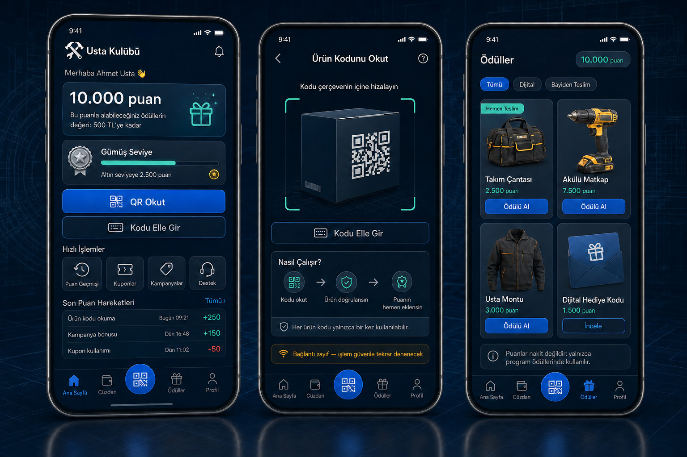
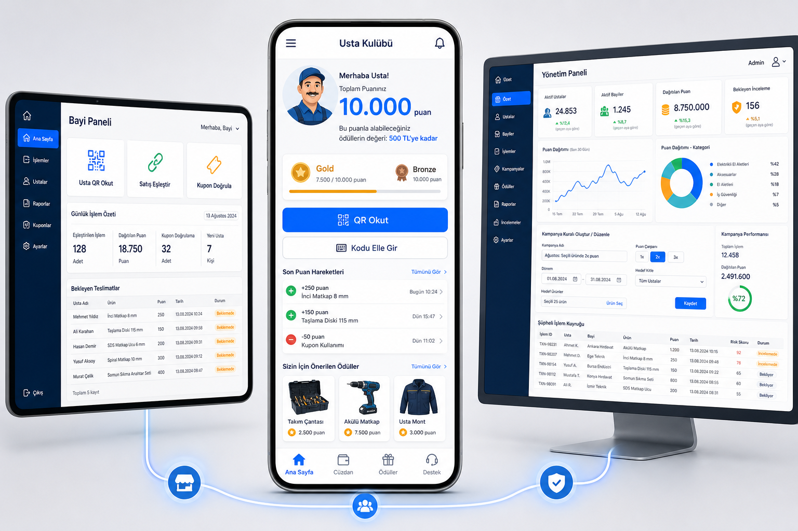

# 15 — Arayüz Konsepti

**Sürüm:** 0.2
**Durum:** Mobil görsel yön ürün sahibi tarafından 18 Ağustos 2026'da onaylandı

## Tercih edilen mobil yön — v2

Bu sürüm üç mobil MVP ekranını birlikte gösterir: ana sayfa, ürün kodu okutma ve ödül kataloğu.
Paylaşılan referanslardaki güçlü koyu tema ve büyük QR eylemi korunmuş; nakit bakiye dili, yabancı
markalar ve MVP dışındaki aktif iş/sözleşme bölümleri kaldırılmıştır.

Ana sayfadaki negatif hareket “Kupon kullanımı” olarak gösterilir. Geçersiz kod denemesi puan
kesintisi oluşturmaz; yalnızca güvenlik/risk sinyali olabilir.

Onaylanan unsur, genel tasarım yönüdür. Görseldeki örnek rakamlar, ürünler ve metin yerleşimleri
gereksinim ve kullanılabilirlik testleri sonucunda değişebilir.

## Ekosistem görünümü — v1

## Görsel neyi anlatıyor?

Tek hesap ve işlem altyapısının üç farklı kullanıcı deneyimine dönüştüğü gösterilmektedir:

- Ortada ustanın telefonundan kullandığı PWA,
- Solda bayi çalışanının hızlı işlem paneli,
- Sağda kampanya ve denetim araçlarını içeren yönetim paneli.

Bu görsel, renk ve yerleşim yönünü tartışmak içindir. Üzerindeki örnek sayı, ürün, tarih ve şirket
verileri gerçek değildir. Kodlamada doğrudan görseldeki sahte veriler kullanılmayacaktır.

## Usta ekranı neden merkezde?

Programın temel değeri ustanın ürünü doğrulaması, puanını anlaması ve ödülünü kolay almasıdır.
Bu nedenle mobil ekran en büyük ve en görünür arayüzdür.

Ana sayfada:

- Puan, para bakiyesi gibi gösterilmez.
- Erişilebilir ödül değeri ayrı cümleyle açıklanır.
- `QR Okut` birincil eylemdir.
- Kamera çalışmazsa `Kodu Elle Gir` hemen altında bulunur.
- Son hareketler, seviye ve ödüller tek ekranda özetlenir.

## Bayi paneli neden daha sade?

Bayi çalışanının müşteriyi bekletmeden birkaç tekrar eden işlemi tamamlaması gerekir. Bu yüzden
ilk ekranda büyük ve doğrudan eylemler bulunur:

- Usta QR okutma,
- Satış eşleştirme,
- Kupon doğrulama,
- Bekleyen ödül teslimleri.

Bayi paneli kapsamlı bir ERP yerine hızlı işlem terminali gibi davranmalıdır.

## Yönetim paneli neden daha yoğun?

Yönetici; kullanıcı işlemi yapmak yerine sistemi yönetir, karşılaştırır ve denetler. Bu nedenle:

- Aktif usta/bayi ve dağıtılan puan göstergeleri,
- Kampanya performansı,
- Kod değiştirmeden kural oluşturma,
- Şüpheli işlem kuyruğu,
- Rapor ve denetim bağlantıları

aynı çalışma alanında yer alır.

## Görsel tasarım ilkeleri

- Güven veren lacivert ve güçlü mavi ana renkler,
- Başarı için yeşil, ödül için sıcak amber,
- Mobilde büyük dokunma alanları,
- Açık arka plan ve yüksek okunabilirlik,
- Puanı parayla karıştırmayan metinler,
- Aynı tasarım dilini kullanan üç rol,
- Gösterişten önce hız ve açıklık.

## Nihai tasarımdan önce yapılacaklar

1. Marka adı, logo ve kurumsal renkler alınacak.
2. Gerçek ürün/ödül türleri belirlenecek.
3. Düşük çözünürlüklü mobil wireframe hazırlanacak.
4. Usta ve bayi temsilcileriyle görev testi yapılacak.
5. Erişilebilirlik ve küçük ekran kontrolleri yapılacak.
6. Onaylanan ekranlar kodlanabilir tasarım sistemine çevrilecek.

## Kullanılacak geliştirme ortamı

### Ana araç: Visual Studio Code

VS Code şu işler için ana çalışma ortamıdır:

- React + TypeScript PWA,
- Ortak tasarım sistemi,
- Yönetim ve bayi web arayüzleri,
- Git, dokümantasyon ve testler,
- Backend dosyalarında hızlı günlük düzenleme.

### Yardımcı araç: Visual Studio 2022

Backend ASP.NET Core olarak kesinleştiğinde Visual Studio 2022 şu işler için kullanılır:

- Ayrıntılı C# hata ayıklama,
- Entity Framework ve veritabanı migration incelemesi,
- Performans profilleme,
- Gelişmiş .NET test ve tanılama araçları.

İki araç aynı Git deposunu açabilir. Aynı dosya iki editörde eşzamanlı değiştirilmemelidir. Günlük
ana pencere VS Code; özel .NET incelemelerinde Visual Studio 2022 olacaktır.

## Görsel üretim kaydı

- Yöntem: OpenAI yerleşik görsel üretim aracı
- Kullanım türü: yüksek doğruluklu UI konsept mockup
- Dosya: `docs/assets/usta-ekosistemi-arayuz-konsepti-v1.png`
- Sürüm: v1; onay veya geri bildirim sonrası yeni dosya adıyla v2 oluşturulur.
